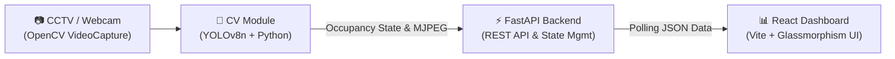

<div align="center">
  
  <h1>GreenGuard AI Energy Monitor</h1>
  <p><strong>A Real-Time, AI-Powered System for Detecting Energy Wastage in Empty Rooms</strong></p>

  <!-- GitHub Badges -->
  <p>
    
    
    
    
    
    
  </p>
</div>

---

## ⚡ Overview

**GreenGuard** is an intelligent, privacy-first computer vision and web dashboard solution designed to monitor room occupancy and flag energy inefficiencies instantly. By utilizing YOLOv8n object detection through exiting CCTV or webcams, GreenGuard spots when a room is completely empty but the lights are left **ON**, sending an automatic "Energy Wastage" alert to facility managers.

## 🚀 Key Features

- **Real-Time AI Occupancy Detection:** Powered by Ultralytics YOLOv8 for sub-second, highly accurate human detection.
- **Privacy-First Architecture:** Automatically blurs detected humans directly on the video feed to ensure strict privacy compliance.
- **Live Stream Dashboard:** View real-time aggregated data, energy scores, and the MJPEG video feed in a beautifully designed React dashboard.
- **Intelligent Error Handling:** Rolling temporal smoothing buffer to ignore sudden glitches and track accurate "Occupied" vs "Empty" states.
- **Low-Latency Backend:** FastAPI manages shared state variables in-memory to drive real-time dashboard UI updates instantly.

---

## 🧩 System Architecture



---

## 📊 SWOT Analysis

| Element | Analysis |
|---------|----------|
| **💪 Strengths** | • Extremely low latency processing with in-memory state scaling<br>• Fully privacy-preserving (on-device local blurring)<br>• Highly visual, intuitive UI requiring no training to use<br>• Lightweight footprint capable of running on edge devices (Jetson, Pi) |
| **📉 Weaknesses** | • Detection accuracy heavily relies on adequate room lighting<br>• Vulnerable to camera blind-spots (requires optimal hardware placement)<br>• Currently relies on simulated light status until fully linked to IoT light switches |
| **🌟 Opportunities** | • Integration with Smart Home/IoT relays to *automatically* turn off lights<br>• Implementation of historical analytics (SQL/NoSQL) to track long-term energy savings<br>• Cloud scalability for multi-campus building monitoring |
| **⚠️ Threats** | • Upfront costs scaling to hundreds of overlapping camera systems<br>• Stringent localized security/privacy policies regarding computer vision in workspaces<br>• Hardware degradation or camera offline states affecting live capabilities |

---

## 🛠️ Tech Stack

- **Computer Vision:** `Python`, `OpenCV`, `Ultralytics (YOLOv8)`
- **Backend API:** `FastAPI`, `Uvicorn`, `Pydantic`
- **Frontend Dashboard:** `React 18`, `Vite`, `Recharts`, `Vanilla CSS (Glassmorphism)`

---

## 💻 Local Development Setup

### 1. Requirements
- Python 3.10+
- Node.js 18+
- Active Webcam/CCTV feed

### 2. Backend & CV Module
Open your terminal, navigate to your green guard folder, and run:
```bash
# Install dependencies
pip install -r requirements.txt

# Start the FastAPI Server (hosts CV service and API)
cd backend
python -m uvicorn main:app --reload --port 8000
```

### 3. Frontend Dashboard
In a secondary terminal:
```bash
# Install Node modules
cd frontend
npm install

# Start the React Vite Server
npm run dev
```

### 4. Running the Complete App
Navigate to `http://localhost:3000` in your browser. 
Click **"Start Camera"** on the dashboard to initialize the YOLOv8 model and begin processing your live video feed!

---

## 📂 Project Structure

```text
greenguard/
├── backend/
│   ├── main.py             # FastAPI entrypoint and CORS config
│   ├── state.py            # Global in-memory storage dictionary
│   ├── cv_service.py       # Threaded YOLOv8 background service & MJPEG streamer
│   ├── models/             # Pydantic schema validation
│   └── routes/             # REST endpoints (/status, /alerts, /cv/start)
├── frontend/
│   ├── index.html          # Web entry point
│   ├── package.json        # Frontend Node dependencies
│   ├── vite.config.js      # Vite build pipeline
│   └── src/
│       ├── App.jsx         # Main Dashboard React component
│       ├── App.css         # UI design system and themes
│       └── components/     # VideoFeed, EnergyChart, AlertPanel, RoomCard
├── cv_module/
│   └── detect.py           # (Legacy) Standalone CV inference script
└── requirements.txt        # Python backend+cv dependencies
```

---

<div align="center">
  <br />
  <p>Built with ❤️ to optimize our environmental footprint.</p>
</div>
